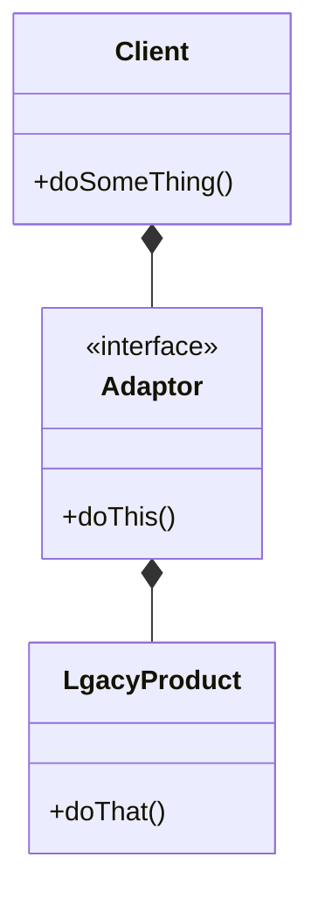

# Adaptor
- connecting new code to legacy code without having to change the working contract produced by the legacy code 
- convert interface into another interface
- you want to do something from client , this thing is not supported by legacy product so the adaptor do that for you 
- if u want to add functionality you can use decorated pattern 

