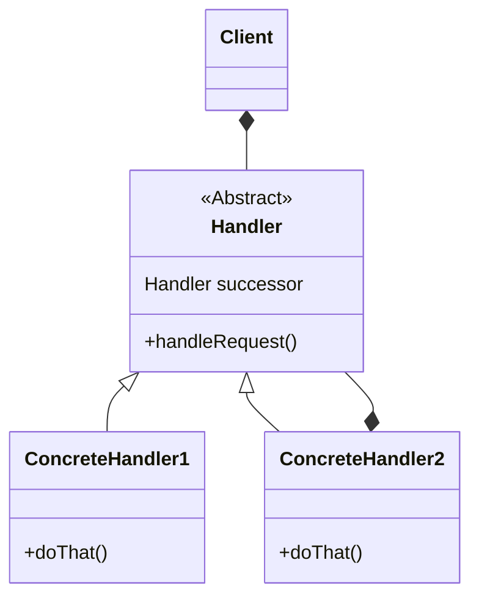

# Chain of responsibility
- decouple the request from a handling object in a chain of handlers until it finally  recognized
- decouple the sender and receiver
- sender shouldn't know the sender and versa 
- receiver contains reference to next receiver
- it doesn't know the whole hierarchy, but it does know the next receiver
- promotes loose coupling 
- you can add chins or modify chain without rewriting large portion of app
- no handler is ok
- example:- spring security filter chain
- 

## class diagram

