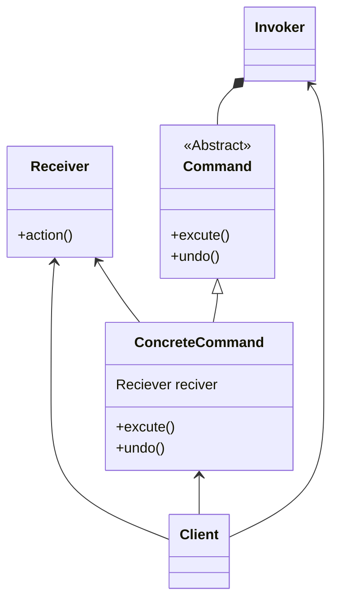

# Command pattern
- we’re going to encapsulate method invocation
- The Command Pattern allows you to decouple the requester of an action from the object that actually performs the action.
- the command objects encapsulate how to do a home automation task along with the object that needs to do it.
- steps :- 
  - The client creates a command object. 
  - The client does a setCommand() to store the command object in the invoker. 
  - Later... the client asks the invoker to execute the command. 
    - Note:as you’ll see later in the chapter, once the command is loaded into the invoker, 
    - it may be used and discarded, or it may remain and be used many times.
- The Command Pattern encapsulates a request as an object, thereby letting you parameterize other objects with different requests, queue or log requests, and support undoable operations.
- in diagram:-
  - client doesn't call action directly but rather works with the invoker to issue a command
  - the action is decoupled from the client

## class diagram

