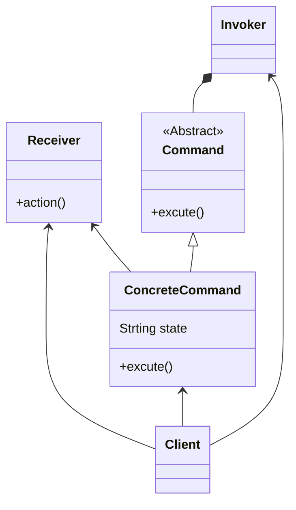

# Command pattern
- encapsulate each request as an object
- each callback is now object-oriented instead of just adding function to this class
- sender is decoupled from processor (maintainability , flexible and grow )
- undo functionality  
- in diagram:-
  - client doesn't call action directly but rather works with the invoker to issue a command
  - the action is decoupled from the client

## class diagram

