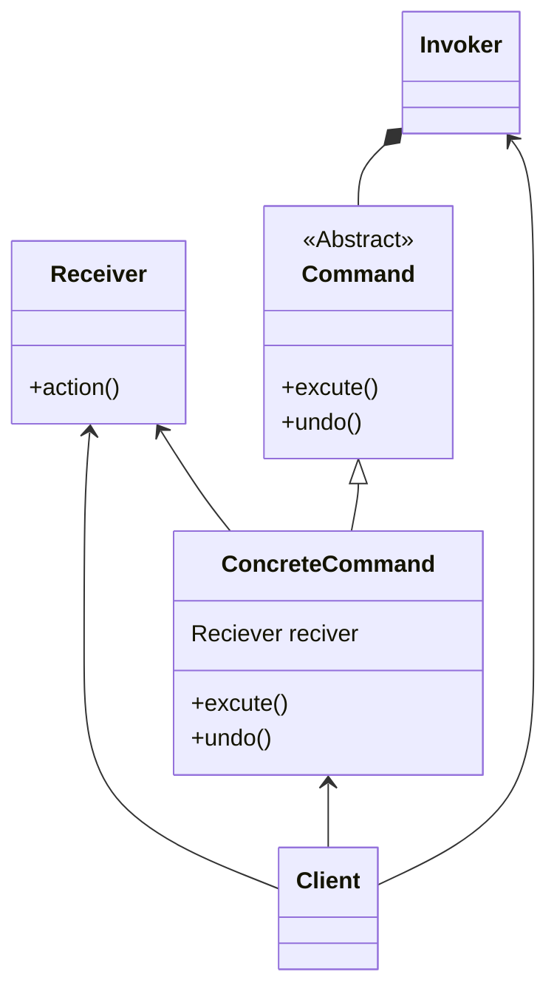

# Command pattern
- we’re going to encapsulate method invocation
- The Command Pattern allows you to decouple the requester of an action from the object that actually performs the action.
- the command objects encapsulate how to do a home automation task along with the object that needs to do it.
- steps :- 
  - The client creates a command object. 
  - The client does a setCommand() to store the command object in the invoker. 
  - Later... the client asks the invoker to execute the command. 
    - Note:as you’ll see later in the chapter, once the command is loaded into the invoker, 
    - it may be used and discarded, or it may remain and be used many times.
- The Command Pattern encapsulates a request as an object, thereby letting you parameterize other objects with different requests, queue or log requests, and support undoable operations.
- actors :- 
  - client :- The Client is responsible for creating a ConcreteCommand and setting its Receiver
  - invoker :- The Invoker holds a command and at some point asks the command to carry out a request by calling its execute() method
  - command :- Command declares an interface for all commands.
  - concrete command :- The ConcreteCommand defines a binding between an action and a Receiver
  - Receiver :- The Receiver knows how to perform the work needed to carry out the request. Any class can act as a Receiver.

## class diagram

