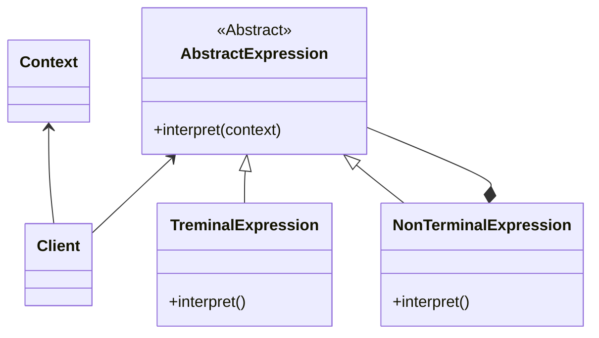

# interpreter pattern
- represent the grammar of a language (music notation , mathematical equations)
- interpret a sentence
- example is pattern (regular)
- pitfalls:-
  - difficult to maintain if pattern is complex
  - one class per rule 
  - specific case 

## class diagram

