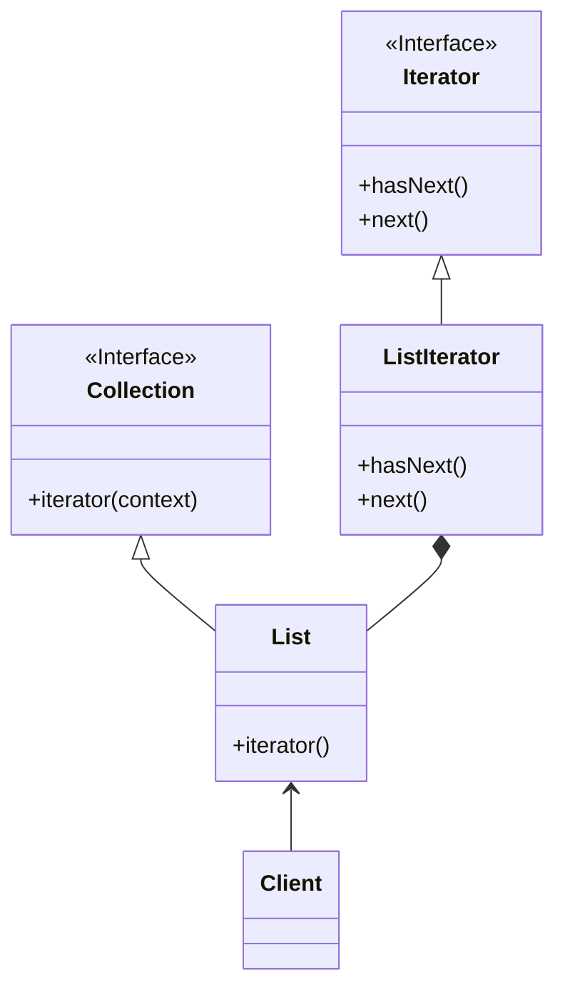

# iterator pattern
- provide navigation without exposing structure of an object
- traverse container
- decouple the data from algorithm used to traverse it
- sequential 
- interface base

## class diagram

