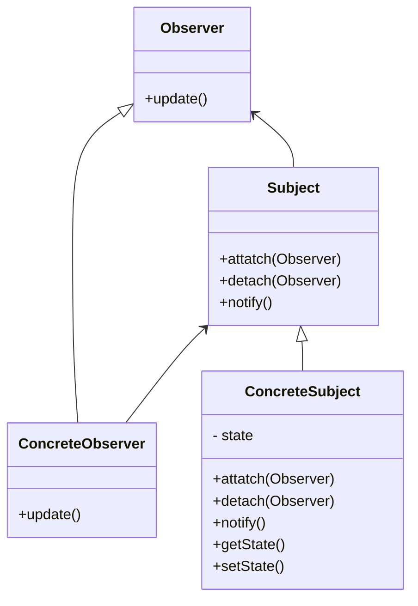

# observer pattern
- when  a subject need to be observed from one or more observers
- The Observer Pattern defines a one-to-many dependency between objects 
- when one object changes state, all of its dependents are notified and updated automatically.
-  Because the subject is the sole owner of that data, the observers are dependent on the subject to update them when the data changes.
- This leads to a cleaner OO design than allowing many objects to control the same data.
- When two objects are loosely coupled, they can interact, but have very little knowledge of each other.
- The only thing the subject knows about an observer is that it implements a certain interface (the Observer interface). 
- It doesn’t need to know the concrete class of the observer, what it does, or anything else about it.
- We can reuse subjects or observers independently of each other.
- We can add new observers at any time
- We never need to modify the subject to add new types of observers.
- Changes to either the subject or an observer will not affect the other.
- Strive for loosely coupled designs between objects that interact.
- Loosely coupled designs allow us to build flexible OO systems that can handle change because they minimize the interdependency between objects.
- subject has one to many observers
- concrete observers have reference to subject to attach/detach themselves 
- you can use
  - push :- let subject push info to observers as params in update method
  - pull :- provide getter for state  in subject and let observers pill the changes
- publisher and subscriber
- use asynchronous fashion
- subject contains state that observers need to listen too.

## class diagram

