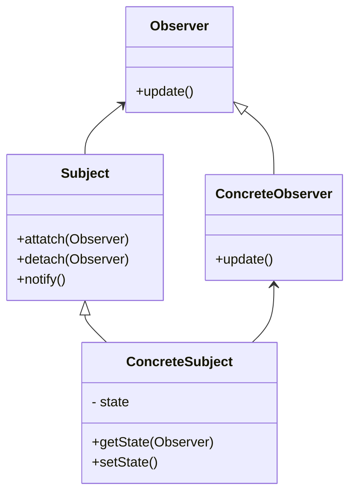

# observer pattern
- when  a subject need to be observed from one or more observers
- subject has one to many observers
- publisher and subscriber
- use asynchronous fashion
- subject contains state that observers need to listen too.

## class diagram

