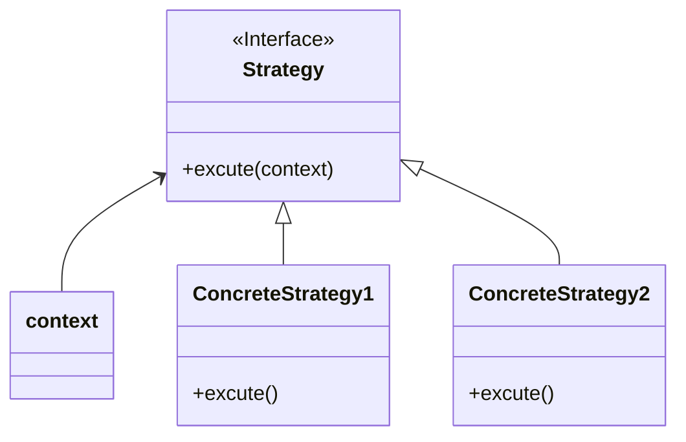

# strategy pattern
- select a strategy or algorithm at run time 
- encapsulate the algorithm in separate class and determined which one at runtime
- eliminate conditional statements if/switch
- strategies are independent 
- same example of factory (graders are strategies)

## class diagram

