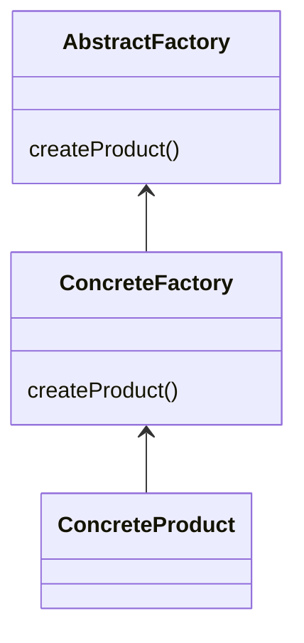

# builder Pattern
- factory of factories 
- factory of related objects
- group factories together
- pitfalls 
  - complexity the mos complex creation pattern 
  - pattern within patterns (framework)
  - start as factory then refactored to AbstractFactory

  

