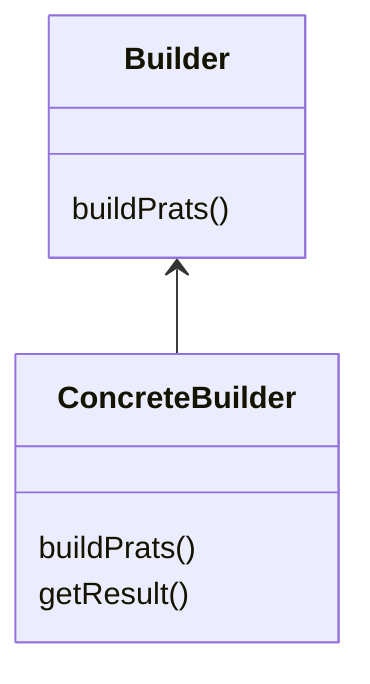

# builder Pattern
- construct object consists of lots of params and want to make it immutable once you constructed it
- solve a problem of determining what constructor to use (telescoping constructors)
- builder solve this by managing construction instead of params
- static inner class
- can be implemented in another class to so it works with legacy code 
- no need to expose setter for each param
- pitfalls 
  - static inner class 
  - immutable 
  - add some complexity to the class 
  

