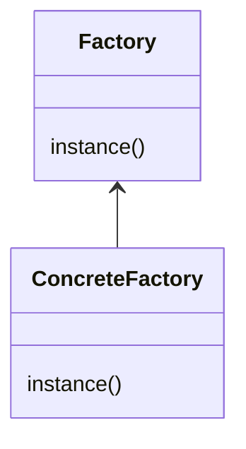
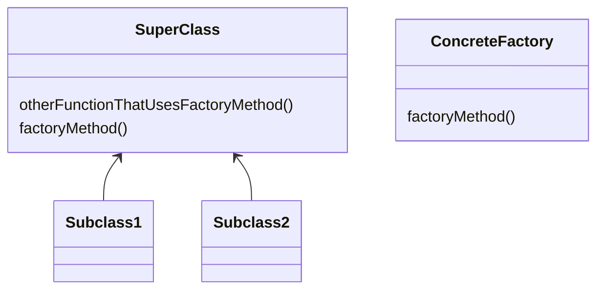

# factory Pattern
- does not expose initiation logic 
- client does not know about initiation or type
- opposite to singleton  
- create object function is parametrized
- pitfalls :-
  - complexity
  - you need to design it from the beginning
- instantiation is an activity that shouldn’t always be done in public and can often lead to coupling problems
- when you use new you are certainly instantiating a concrete class, so that’s definitely an implementation, not an interface. 
- And it’s a good question; you’ve learned that tying your code to a concrete class can make it more fragile and less flexible 
- Defining a simple factory as a static method is a common technique and is often called a static factory.
- Why use a static method? Because you don’t need to instantiate an object to make use of the create method.
- But remember it also has a disadvantage that you can’t subclass and change the behavior of the create method. 

## simple factory 

## factory method 
  - A factory method handles object creation and encapsulates it in a subclass.
  - This decouples the client code in the superclass from the object creation code in the subclass.

