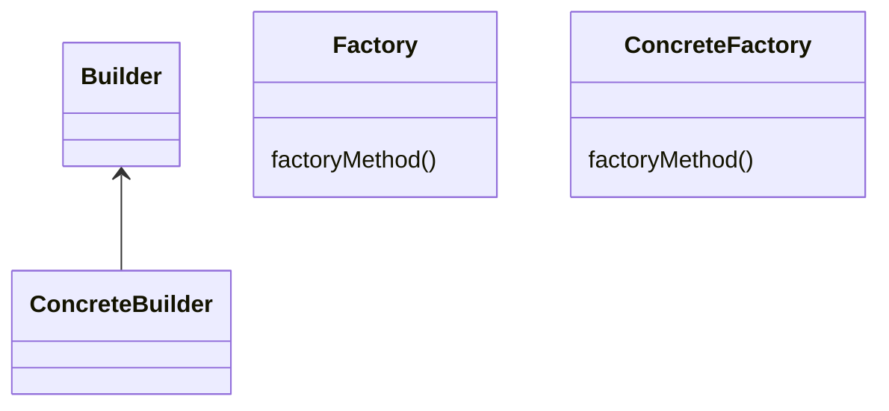

# factory Pattern
- does not expose initiation logic 
- client does not know about initiation or type
- opposite to singleton  
- create object function is parametrized
- pitfalls :-
  - complexity
  - you need to design it from the beginning 

