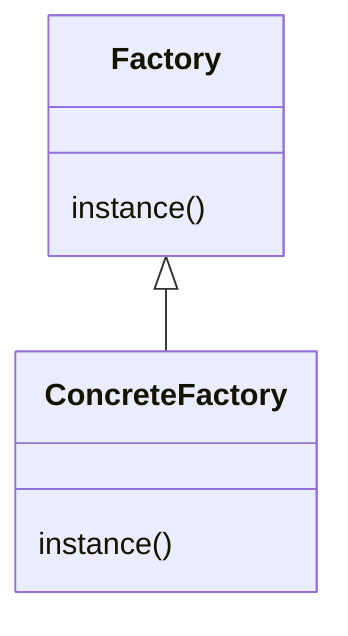
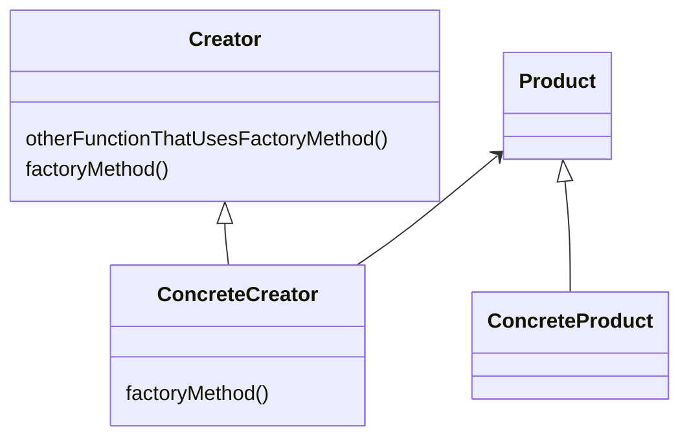
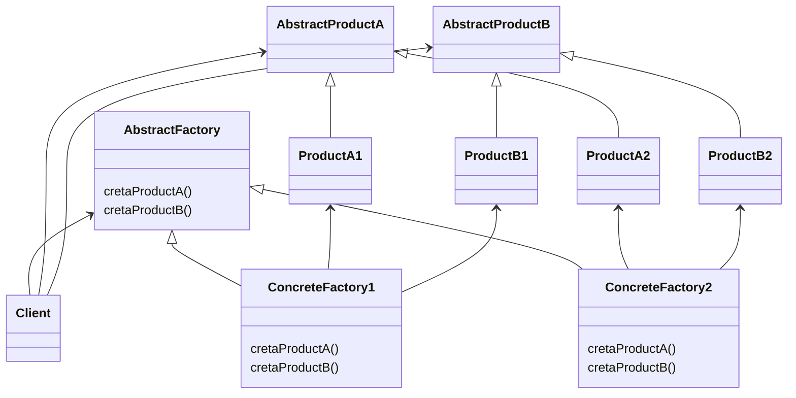

# factory Pattern
- The Factory Method Pattern defines an interface for creating an object.
- but lets subclasses decide which class to instantiate.
- Factory Method lets a class defer instantiation to subclasses.
- does not expose initiation logic 
- client does not know about initiation or type
- opposite to singleton  
- create object function is parametrized
- pitfalls :-
  - complexity
  - you need to design it from the beginning
- instantiation is an activity that shouldn’t always be done in public and can often lead to coupling problems
- when you use new you are certainly instantiating a concrete class, so that’s definitely an implementation, not an interface. 
- And it’s a good question; you’ve learned that tying your code to a concrete class can make it more fragile and less flexible 
- Defining a simple factory as a static method is a common technique and is often called a static factory.
- Why use a static method? Because you don’t need to instantiate an object to make use of the create method.
- But remember it also has a disadvantage that you can’t subclass and change the behavior of the create method. 
- They say “decide” not because the pattern allows subclasses themselves to decide at runtime, but because the creator class is written
  without knowledge of the actual products that will be created, which is decided purely by
  the choice of the subclass that is used.

## simple factory 

## factory method 
  - A factory method handles object creation and encapsulates it in a subclass.
  - This decouples the client code in the superclass from the object creation code in the subclass.

## abstract factory 
- The Abstract Factory Pattern provides an interface for creating families of related or dependent objects
  without specifying their concrete classes.
- An Abstract Factory gives us an interface for creating a family of products.
- By writing code that uses this interface, we decouple our code from the actual factory that creates the products. 
- That allows us to implement a variety of factories that produce products meant for different contexts.
- such as different regions, different operating systems, or different look and feels.

