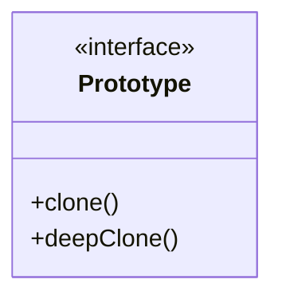

# prototype Pattern
- clone existing instance to produce new instance
- avoid costly creation
- refactor pattern
- costly constructors not handled by client
- has shallow and deep copy 
- pitfalls
  - not clear to be used
  - pattern contains other patterns is a framework and this pattern always used with others
  - most time you need deep copy while clone interface provides shallow copy, so you need to implement it from scratch

