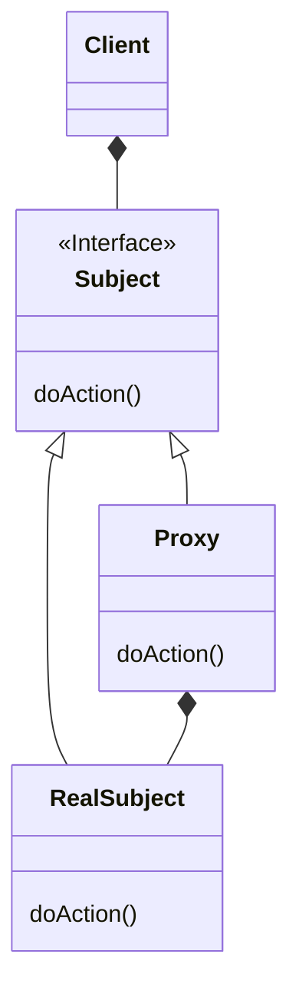

# singleton Pattern 
- only one instance of an object
- static in nature but not by static class 
- because its needs to be thread save 
- have private intense and constructor

```mermaid
 classDiagram
    Client *-- Subject
    Subject <|-- Proxy
    Subject <|--RealSubject
    Proxy *-- RealSubject
    
    class Subject {
     doAction()
    } 
    
    <<Interface>>  Subject
    
    class RealSubject {
       doAction()
    }
    
    class Proxy {
         doAction()
    }
```