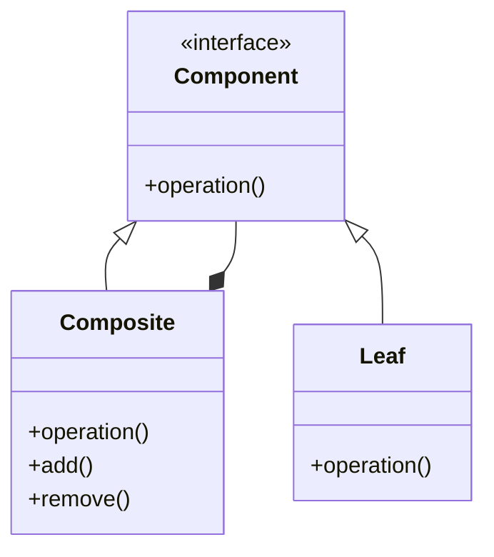

# Composite Pattern 
- deals with tree structure of information
- compose objects into tree structure
- same operations applies on individual and composite and expect them to behave the same way
- tree structured
- component is building bloc of pattern 
- component is a leaf or composite object 
- composite knows about children 
- participants :-
  - component :- interface 
  - leaf :- component 
  - composite :- component that has children and implement methods that manipulate them
- pitfalls
  - can lead to runtime checks

