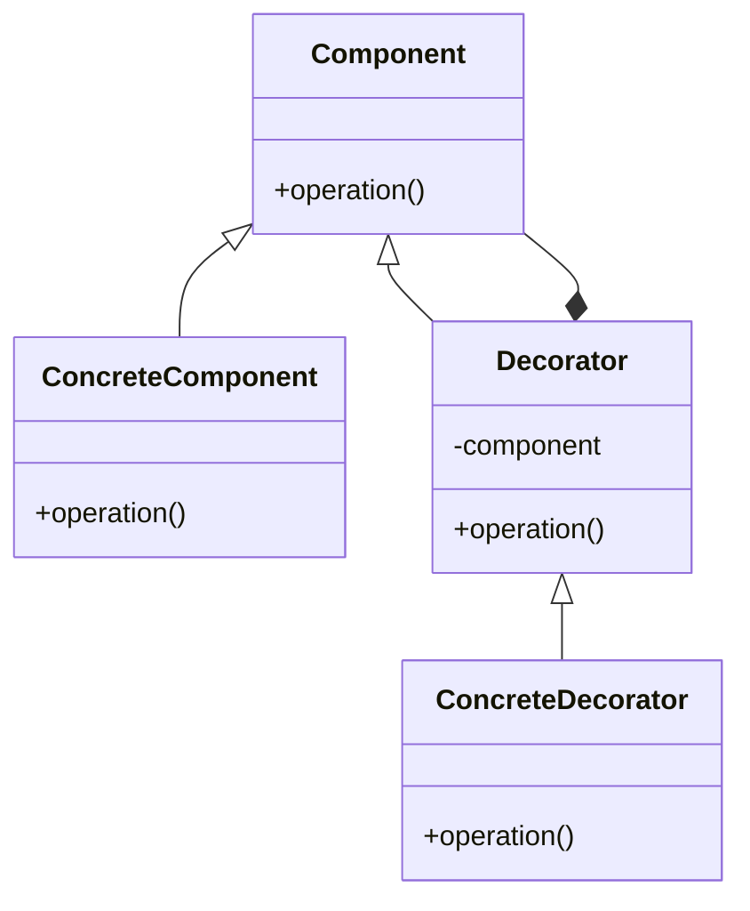

# Decorator Pattern 
- wrap another object to add functionality to it 
- add behavior without affecting others
- compose behavior dynamically by using subclasses of decorated object
- utilize both inheritance and composition 
- alternative of subclasses 

