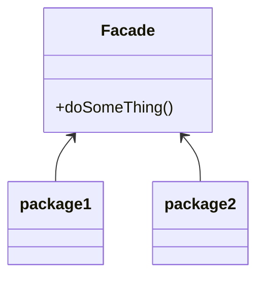

# Facade Pattern 
- make api easier to use 
- simplify interface or client usage 
- it's refactoring pattern 
- used with poorly designed api 
- utilize composition only , no need for inheritance 
- 

