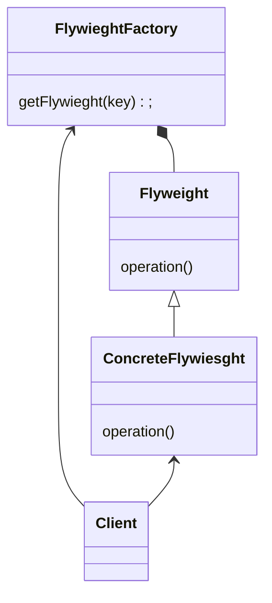

# Flyweight Pattern 
- minimize use of memory by sharing data between similarly typed objects 
- make more efficient use of memory 
- large number of immutable stateless objects (String in java)
- pattern of patterns (utilize factory)
- encompasses creating and structure 

