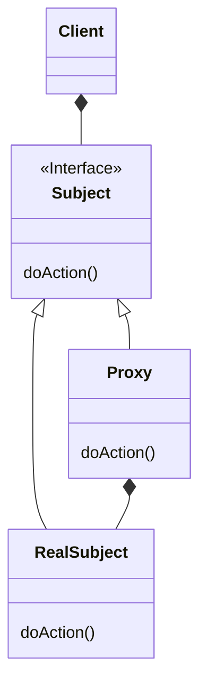

# Proxy Pattern 
- interface to something else
- interface by wrapping 
- can add functionality 
- problem to solve :- security , simplicity , remote , cost
- proxy is called to access the real object 
- proxy resides between an interface and impl class
- java provides two classes to facilitate deailing with proxy:-
  - invocationHandler 
  - Proxy(java.lang.reflect)
- Proxy uses these class to do its job

